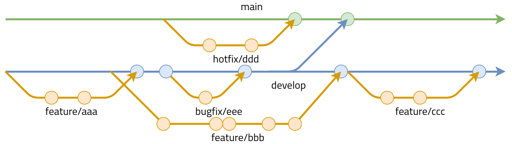

<!--
theme: default
paginate: true
-->

# Vertiefung Software Engeneering
## Nils Robinet

---

# Gliederung

1. Aufgabenstellung
2. Demo Anwendung
3. CI/CD-Pipeline
    1. Stages
    1. Build
    2. Test
    2. Deploy
4. Git-Strategie

---

# Aufgabenstellung

Thema 1

- Aufbau und Benuztung einer CI/CD-Pipeline
    - Containerisiert
    - In einer VM
- Projekt, das in der CI/CD-Pipeline entwickelt wird
    - Unit-Tests
- Git zur Code Verwaltung

---

# Demo Anwendung

Vorgabe: Legen Sie ein Projekt an, welches auch über rudimentäre Funktionen verfügt (...).

- Implementation des Eigenface-Algorithmus als C++ Bibliothek
- Python Interface für die C++ Bibliothek
- Demo Webserver-Anwendung für die Nutzung der Bibliothek

---

# CI/CD Pipeline

- Build Server: Jenkins
- Projekt Typ: Multibranch Pipeline
- OS: Arch Linux
- Build-Agent: Docker-Container

---

# Stages

1. Build
2. Test
2. Docu
4. Deploy
5. Post

---

# Build

Aufruf verschiedener Skripte

- C++ Build mit CMake
- Installation der Webanwendung in Docker-Container

---

# Test

C++: Google Test

Python: pytest und pylint

---

# Deploy

Deployment der Webanwendung

- Kopieren des gepackten Docker-Image auf den Ziel Server
- Import des Docker-Image
- Start der Anwendung im Docker-Container

---

# Git-Strategie

Git-Flow

---

# Fragen?
